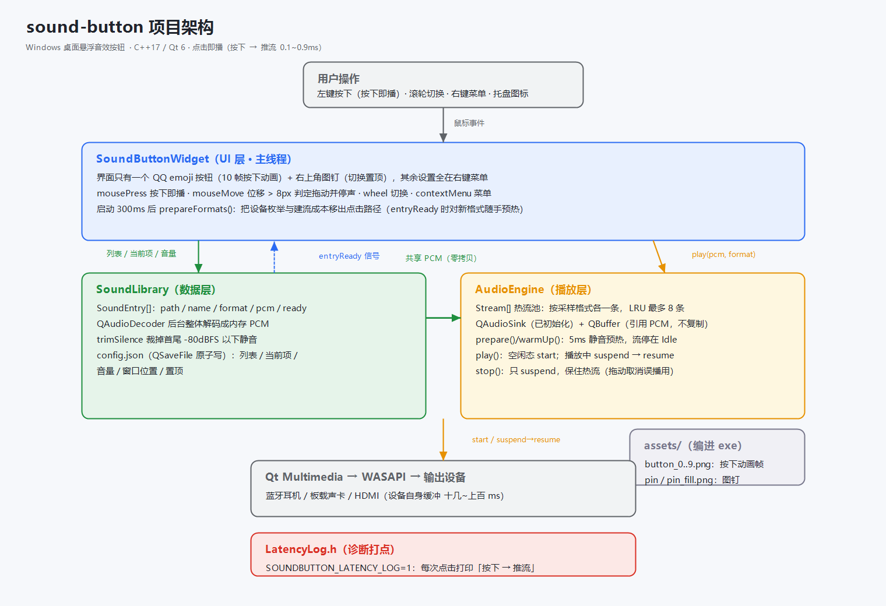
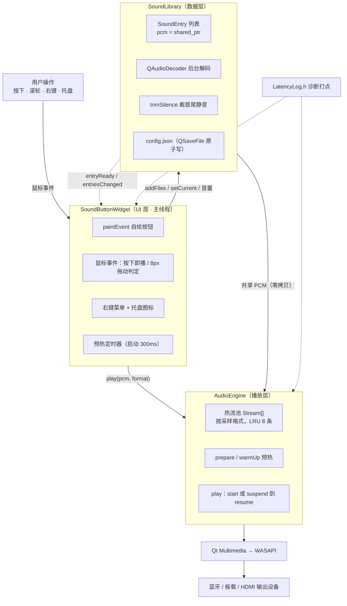
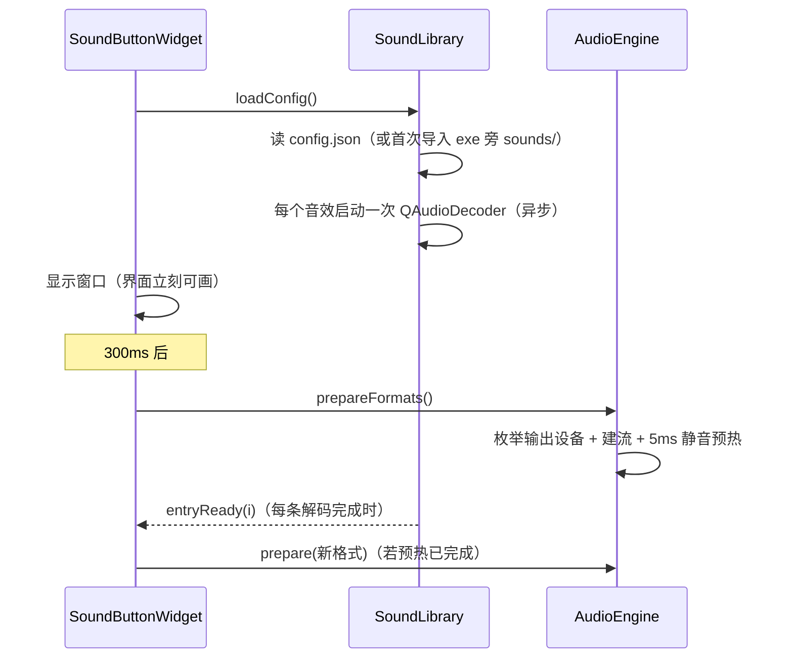
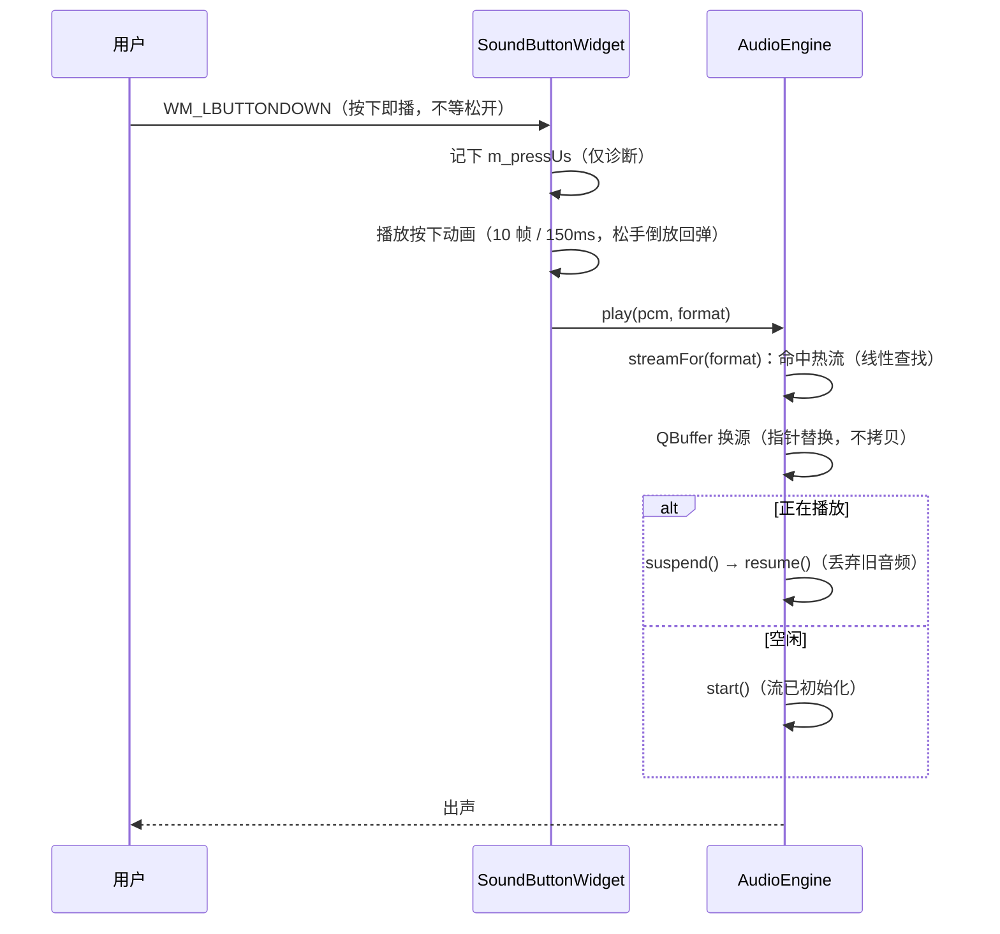

# 架构说明（sound-button）

> 面向要改代码的人：这里讲清楚分层、依赖方向，以及"点击到出声 <1ms"是怎么拆出来的。
> 上手用法看 [README.md](README.md)，改代码前必读 [AGENTS.md](AGENTS.md)。

## 一、整体结构



```
用户操作：左键按下（按下即播）· 滚轮切换 · 右键菜单 · 托盘图标 · 右上角图钉切换置顶
└─ SoundButtonWidget —— UI 层（主线程，唯一持有界面与业务的地方）
   ├─ 界面 = QQ emoji 按钮（10 帧按下动画）+ 右上角图钉，窗口里一个文字都没有
   ├─ 状态用浓淡表达：解码中 55% 透明、失败 40% + 右下角红点；音效名走 tooltip / 切换气泡
   ├─ 素材：assets/button_0..9.png（离线烘焙的按钮帧）+ pin / pin_fill.png，编进 exe
   ├─ mousePress 按下即播 · mouseMove 超 8px 判拖动并停声 · wheel 切换 · contextMenu 菜单
   ├─ QSystemTrayIcon 托盘 · 启动 300ms 后 prepareFormats() 预热
   ├─▶ SoundLibrary —— 数据层
   │     SoundEntry[]：path / name / format / pcm(shared_ptr) / ready / failed / trimmedLeadMs
   │     QAudioDecoder 后台整体解码 → trimSilence 裁掉首尾静音
   │     config.json（QSaveFile 原子写）：列表 / 当前项 / 音量 / 窗口位置 / 置顶
   │            └── entryReady 信号 ──▶ 回到 UI：重绘 + 对新格式顺手预热
   └─▶ AudioEngine —— 播放层
         Stream[] 热流池：按采样格式各一条（LRU 最多 8 条），始终保持在"已初始化"
         一条流 = QAudioSink + QBuffer（只引用 PCM，不复制）+ silence 预热数据
         prepare()/warmUp() 预热 · play() 起播 · stop() 只 suspend
                └──▶ Qt Multimedia → WASAPI → 蓝牙 / 板载 / HDMI 输出设备
```

`SoundLibrary` 与 `AudioEngine` 互不认识：PCM 以 `shared_ptr<QByteArray>` 的形式，
经 UI 层从数据层交到播放层（零拷贝）。

Mermaid 版（GitHub 与支持 Mermaid 的编辑器可直接渲染）：



## 二、模块职责

| 文件 | 层 | 职责 | 关键点 |
| --- | --- | --- | --- |
| `src/main.cpp` | 入口 | 起 `QApplication`、显示窗口、进事件循环 | 十几行；所有逻辑都在窗口里 |
| `src/SoundButtonWidget.*` | UI | 无边框置顶小窗、自绘、鼠标/滚轮/右键、托盘、预热调度 | 只调用数据层与播放层，不碰音频 API |
| `src/SoundLibrary.*` | 数据 | 音效列表、后台预解码、裁静音、`config.json` 持久化 | `QAudioDecoder` → 内存 PCM（`shared_ptr`） |
| `src/AudioEngine.*` | 播放 | 按采样格式维护热流池、推流、停声、音量 | `QAudioSink` + `QBuffer`，零拷贝 |
| `src/LatencyLog.h` | 诊断 | 「按下 → 推流」耗时打点 | 直接 `fprintf(stderr)`，环境变量开关 |
| `assets/` | 素材 | 按钮 10 帧动画 + 图钉图标 | 编进 exe（`qt_add_resources`），运行时零外部依赖 |
| `tools/bake-button-frames.ps1` | 素材 | 把 QQ emoji 的 Lottie 动画烘焙成 `assets/button_*.png` | Chrome/Edge 无头 + lottie-web，离线跑一次 |
| `tools/gen-preview.ps1` | 文档 | 生成 `preview.png` | 与程序同一套绘制规则 |
| `tools/gen-architecture-diagram.ps1` | 文档 | 生成本文开头那张架构图（`docs/architecture.png`） | 只用 System.Drawing，无第三方依赖 |

依赖方向单向：`main → SoundButtonWidget → { SoundLibrary, AudioEngine }`。

## 三、两条关键路径

### 1）启动：把昂贵的事一次做完



代价分布：设备枚举 1~3 秒、建流与流初始化 13~125ms/条、解码 0.1~1.3 秒/条——
全部发生在启动阶段，且不阻塞首次点击（点击时若还没解码完，`entryReady` 会自动补播）。

### 2）点击：只剩「换数据 + 起播」



## 四、延迟预算（本机实测，Qt 6.10 / WASAPI）

| 环节 | 实测 | 能否优化 |
| --- | --- | --- |
| 进程内第一条鼠标消息的系统投递 | ~10ms | 否，Windows 侧行为 |
| Qt 事件派发到处理函数 | 0.2~1.4ms | 否 |
| 按下 → 推流（应用内） | 0.08~0.9ms | 已经是"换数据 + 起播" |
| 音效文件自带开头静音 | 已裁（原 79~169ms） | 已消除 |
| 音频后端 + 设备缓冲 | 十几~上百 ms | 否，蓝牙/HDMI 自身缓冲 |

想复测：`set SOUNDBUTTON_LATENCY_LOG=1 && build\soundbutton.exe 2> lat.log`，每次点击打印一行。

## 五、状态与生命周期

- **热流池**：`AudioEngine::Stream{format, deviceId, sink, buffer, silence, pcm, lastUsedUs, warmed}`。
  按采样格式区分（`44100Hz/2ch` 与 `48000Hz/2ch` 是两条流），最多 8 条，超出淘汰最久未用的。
- **PCM 所有权**：`SoundEntry::pcm` 与 `Stream::pcm` 共享同一个 `shared_ptr<QByteArray>`；
  `QBuffer` 只引用这块内存，所以「播放中删掉音效条目」也不会悬空，且点击路径零拷贝。
  同一 `Stream` 的 `silence`（预热静音）必须与 `QBuffer` 同生命周期。
- **设备变化**：`QMediaDevices::audioOutputsChanged` → `invalidateSinks()` 丢弃全部热流
  → `prepareFormats()` 在新设备上重建（旧设备上的流已无意义）。
- **窗口层状态**（音量/位置/置顶/列表）统一存在 exe 旁的 `config.json`，由 `SoundLibrary` 读写。

## 六、必须守住的不变量

1. **点击路径上只能有「换数据 + 起播」**：不解码、不枚举设备、不建流、不拷贝、不打日志 I/O。
2. **重播不要用 `stop() + start()`**（会重建 WASAPI 流，13~125ms），要用 `suspend() → resume()`。
3. **停声（拖动取消误播）用 `suspend()`**，保住热流的初始化状态。
4. **流要停在 Idle 而不是 Stopped**：空闲态起播才只要 0.1ms。
5. **`QAudioSink` 只在主线程使用**；解码在 Qt 内部线程，主线程只收信号。
6. **拖动判定阈值 8px** 是交互契约的一部分（超阈值停掉误播），改交互时要保留。
7. **界面不放文字**：窗口里只有按钮和图钉，音效名/状态一律走 tooltip、切换气泡与浓淡；图钉命中区只负责置顶，不播音效、不触发按下动画。
8. **按钮动画是离线烘焙的位图**：运行时不做 Lottie 渲染（改素材见 `AGENTS.md` 的「界面素材」一节）。
