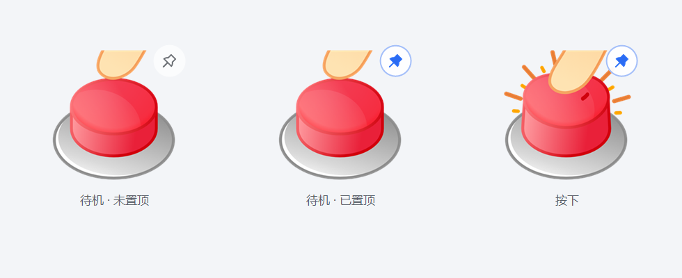

# 桌面音效按钮（Sound Button）

一个常驻桌面的悬浮小按钮，点击即播音效。C++17 / Qt 6 / CMake 构建，Windows 下免安装、低延迟。



## 功能

- **点击即播**：解码在添加时后台完成，播放直接推内存 PCM 给声卡，点击到出声约 10~30ms（按"按下"触发，非松开）。
- **再次点击**：停止并从头重播。
- **滚轮**：切换上一个 / 下一个音效。
- **右键菜单**：
  - 音效列表（点选切换并播放）
  - 添加音效…（多选文件）
  - 移除当前音效
  - 音量（滑杆）
  - 窗口置顶 开/关
  - 退出
- **拖动**：按住拖动可移动按钮位置，自动保存。
- **托盘图标**：单击显示/隐藏按钮，右键可退出。
- **格式**：mp3 / wav / ogg / flac / m4a / aac / opus / wma 等（经 FFmpeg 解码），目前以 mp3 为主。
- **记忆**：音效列表、当前音效、音量、窗口位置、置顶状态存于 exe 旁 `config.json`，便携可带走。

## 使用

把音效文件放进 exe 旁的 `sounds/` 文件夹后首次启动会自动全部导入；或运行后右键 →「添加音效…」手动选择。

- 开发运行：`build/soundbutton.exe`（需 MSYS2 UCRT64 环境的 PATH）
- 独立运行：`dist/soundbutton.exe`（已打包全部依赖，可单独拷走整个 dist 文件夹）

## 构建（MSYS2 UCRT64）

```bash
pacman -S mingw-w64-ucrt-x86_64-qt6-multimedia   # 一次性环境准备
PATH="/d/Library/msys64/ucrt64/bin:$PATH" cmake -S . -B build -G Ninja -DCMAKE_BUILD_TYPE=Release
PATH="/d/Library/msys64/ucrt64/bin:$PATH" cmake --build build
```

## 重新打包 dist

```bash
cp build/soundbutton.exe dist/
PATH="/d/Library/msys64/ucrt64/bin:$PATH" windeployqt --release --no-compiler-runtime dist/soundbutton.exe
# 再按 dist 内 DLL 的递归依赖，从 ucrt64/bin 复制缺失的非 Qt DLL（avcodec、libstdc++ 等）
```

## 代码结构

```
src/main.cpp              入口
src/SoundButtonWidget.*   悬浮按钮窗口：绘制、按下播放、拖动、滚轮、右键菜单、托盘
src/SoundLibrary.*        音效列表：QAudioDecoder 预解码成内存 PCM、config.json 持久化
src/AudioEngine.*         QAudioSink 播放封装：复用设备、点击即推流
```
